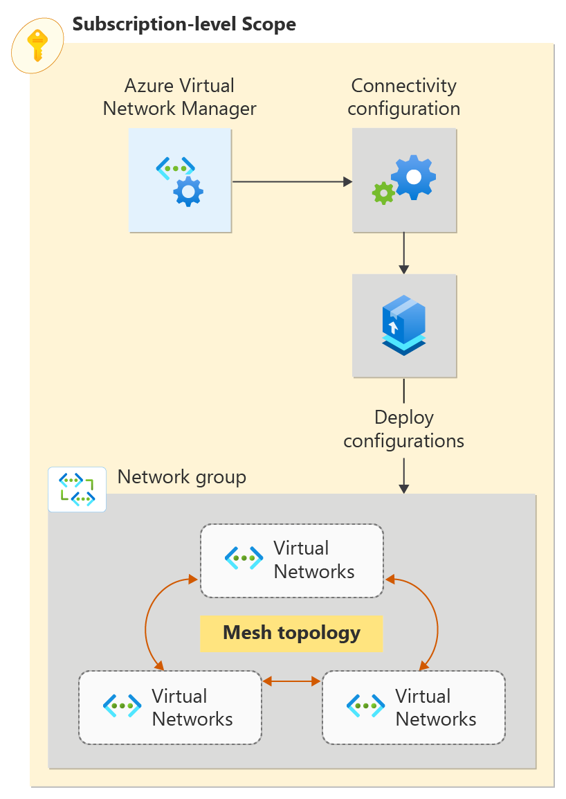

# 💡 Module 1&#x20;

## Fundamentals of Cloud Computing

**What is cloud computing**?

Cloud computing is the delivery of computing services like VM, Storage, Database, Networking etc over the internet.

**Benefits** :-

* Cloud enables software developers, engineers IT professionals to create, build, test and deploy technical solutions productively, effectively and securely
* Cloud engineering offers better speed of development,testing ,maintainability ,automation, scalability and so much more.

## **Cloud Computing vs Virtualization**&#x20;

The main difference between cloud computing and virtualization is, cloud is an environment while virtualization is a technology that enables us to virtualize hardware to create and simulate several machines or dedicated source.

Cloud computing provides on-demand resources for computing, storage, network, platform, webapplications and infrastructure over the internet or cloud. These are pools of virtual services and resources hosted on the cloud, which is accessible by its users anywhere in the world.

## Cloud Hypervisor&#x20;

Hypervisor technology is emerging as a vital tool in virtualizing resources and is driving modern innovation in cloud environments. Hypervisors make resources and applications in the cloud available to their users remotely.

eg:- Microsoft uses a native hypervisor on Azure called Azure Hypervisor

<figure><figcaption>
HyperVisor Technology
</figcaption></figure>
