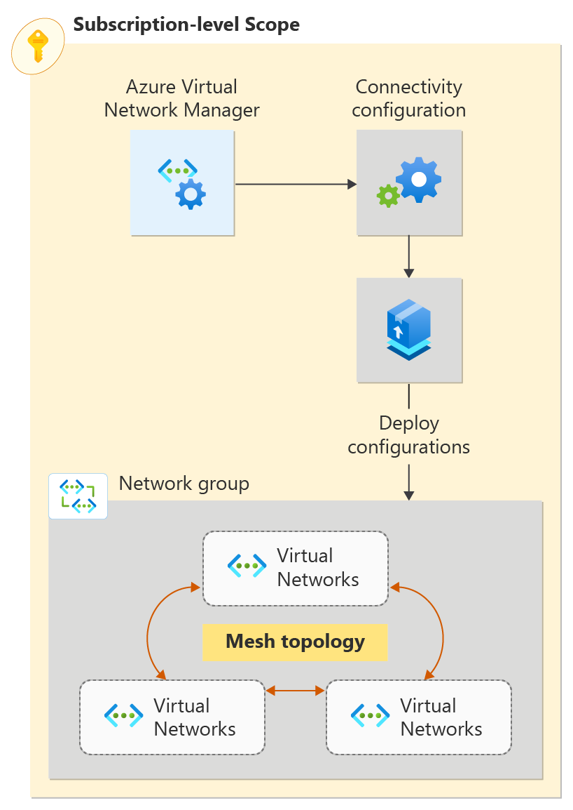

# 💡 Module 3

## Azure Networking

Azure Networking is a category of services in Microsoft Azure that provides fully managed and scalable networking and connectivity options like making a connection between your on-premises data center and the cloud. With networking services in Azure, you can also build secure virtual network infrastructure, manage your application’s network traffic, and protect your applications against DDoS attacks. Networking resources in Azure can also be used to enable secure remote access to internal resources within your organizations and globally route your network connectivity with monitoring and security features.

The networking services in Azure provide various networking capabilities that can be used together or separately. Select any of the following key capabilities to learn more about them:

* [**Connectivity services**](https://learn.microsoft.com/en-us/azure/networking/fundamentals/networking-overview#connect): Connect Azure resources and on-premises resources using any or a combination of these networking services in Azure - Virtual Network (VNet), Virtual WAN, ExpressRoute, VPN Gateway, Virtual network NAT Gateway, Azure DNS, Peering service, Azure Virtual Network Manager, Route Server, and Azure Bastion.
* [**Application protection services**](https://learn.microsoft.com/en-us/azure/networking/fundamentals/networking-overview#protect): Protect your applications using any or a combination of these networking services in Azure - Load Balancer, Private Link, DDoS protection, Firewall, Network Security Groups, Web Application Firewall, and Virtual Network Endpoints.
* [**Application delivery services**](https://learn.microsoft.com/en-us/azure/networking/fundamentals/networking-overview#deliver): Deliver applications in the Azure network using any or a combination of these networking services in Azure - Content Delivery Network (CDN), Azure Front Door Service, Traffic Manager, Application Gateway, Internet Analyzer, and Load Balancer.
* [**Network monitoring**](https://learn.microsoft.com/en-us/azure/networking/fundamentals/networking-overview#monitor): Monitor your network resources using any or a combination of these networking services in Azure - Network Watcher, ExpressRoute Monitor, Azure Monitor, or VNet Terminal Access Point (TAP).

## Virtual network 

[Azure Virtual Network (VNet)](https://learn.microsoft.com/en-us/azure/virtual-network/virtual-networks-overview) is the fundamental building block for your private network in Azure. You can use VNets to:

* **Communicate between Azure resources**: You can deploy virtual machines, and several other types of Azure resources to a virtual network, such as Azure App Service Environments, the Azure Kubernetes Service (AKS), and Azure Virtual Machine Scale Sets. To view a complete list of Azure resources that you can deploy into a virtual network, see [Virtual network service integration](https://learn.microsoft.com/en-us/azure/virtual-network/virtual-network-for-azure-services).
* **Communicate between each other**: You can connect virtual networks to each other, enabling resources in either virtual network to communicate with each other, using virtual network peering or Azure Virtual Network Manager. The virtual networks you connect can be in the same, or different, Azure regions. For more information, see [Virtual network peering](https://learn.microsoft.com/en-us/azure/virtual-network/virtual-network-peering-overview) and [Azure Virtual Network Manager](https://learn.microsoft.com/en-us/azure/virtual-network-manager/overview).
* **Communicate to the internet**: All resources in a VNet can communicate outbound to the internet, by default. You can communicate inbound to a resource by assigning a public IP address or a public Load Balancer. You can also use [Public IP addresses](https://learn.microsoft.com/en-us/azure/virtual-network/ip-services/virtual-network-public-ip-address) or public [Load Balancer](https://learn.microsoft.com/en-us/azure/load-balancer/load-balancer-overview) to manage your outbound connections.
* **Communicate with on-premises networks**: You can connect your on-premises computers and networks to a virtual network using [VPN Gateway](https://learn.microsoft.com/en-us/azure/vpn-gateway/vpn-gateway-about-vpngateways) or [ExpressRoute](https://learn.microsoft.com/en-us/azure/expressroute/expressroute-introduction).

## Azure Virtual Network Manager 

Azure Virtual Network Manager is a management service that enables you to group, configure, deploy, and manage virtual networks globally across subscriptions. With Virtual Network Manager, you can define network groups to identify and logically segment your virtual networks. Then you can determine the connectivity and security configurations you want and apply them across all the selected virtual networks in network groups at once.

\

<figure><figcaption></figcaption></figure>

## ExpressRoute

ExpressRoute enables you to extend your on-premises networks into the Microsoft cloud over a private connection facilitated by a connectivity provider. This connection is private. Traffic doesn't go over the internet. With ExpressRoute, you can establish connections to Microsoft cloud services, such as Microsoft Azure, Microsoft 365, and Dynamics 365.

\

<figure><figcaption></figcaption></figure>

## VPN Gateway 

VPN Gateway helps you create encrypted cross-premises connections to your virtual network from on-premises locations, or create encrypted connections between VNETts. There are different configurations available for VPN Gateway connections. Some of the main features include:

Site-to-site VPN connectivity Point-to-site VPN connectivity VNet-to-VNet VPN connectivity The following diagram illustrates multiple site-to-site VPN connections to the same virtual network. To view more connection diagrams, see VPN Gateway - design.

<figure><figcaption></figcaption></figure>

## Azure DNS

## [Azure DNS](https://learn.microsoft.com/en-us/azure/dns/) provides DNS hosting and resolution using the Microsoft Azure infrastructure. Azure DNS consists of three services:

* [Azure Public DNS](https://learn.microsoft.com/en-us/azure/dns/dns-overview) is a hosting service for DNS domains. By hosting your domains in Azure, you can manage your DNS records by using the same credentials, APIs, tools, and billing as your other Azure services.
* [Azure Private DNS](https://learn.microsoft.com/en-us/azure/dns/private-dns-overview) is a DNS service for your virtual networks. Azure Private DNS manages and resolves domain names in the virtual network without the need to configure a custom DNS solution.
* [Azure DNS Private Resolver](https://learn.microsoft.com/en-us/azure/dns/dns-private-resolver-overview) is a service that enables you to query Azure DNS private zones from an on-premises environment and vice versa without deploying VM based DNS servers.

Using Azure DNS, you can host and resolve public domains, manage DNS resolution in your virtual networks, and enable name resolution between Azure and your on-premises resources.

## Azure Bastion

Azure Bastion is a service that you can deploy to let you connect to a virtual machine using your browser and the Azure portal, or via the native SSH or RDP client already installed on your local computer. The Azure Bastion service is a fully platform-managed PaaS service that you deploy inside your virtual network. It provides secure and seamless RDP/SSH connectivity to your virtual machines directly from the Azure portal over TLS. When you connect via Azure Bastion, your virtual machines don't need a public IP address, agent, or special client software.

<figure><figcaption></figcaption></figure>

## Virtual network NAT Gateway 

Virtual Network NAT(network address translation) simplifies outbound-only Internet connectivity for virtual networks. When configured on a subnet, all outbound connectivity uses your specified static public IP addresses. Outbound connectivity is possible without load balancer or public IP addresses directly attached to virtual machines.&#x20;

<figure><figcaption></figcaption></figure>

## Route Server

Azure Route Server simplifies dynamic routing between your network virtual appliance (NVA) and your virtual network. It allows you to exchange routing information directly through Border Gateway Protocol (BGP) routing protocol between any NVA that supports the BGP routing protocol and the Azure Software Defined Network (SDN) in the Azure Virtual Network (VNet) without the need to manually configure or maintain route tables.

### Application protection services 

This section describes networking services in Azure that help protect your network resources - Protect your applications using any or a combination of these networking services in Azure - DDoS protection, Private Link, Firewall, Web Application Firewall, Network Security Groups, and Virtual Network Service Endpoints.

#### DDoS Protection 

[Azure DDoS Protection](https://learn.microsoft.com/en-us/azure/ddos-protection/manage-ddos-protection) provides countermeasures against the most sophisticated DDoS threats. The service provides enhanced DDoS mitigation capabilities for your application and resources deployed in your virtual networks. Additionally, customers using Azure DDoS Protection have access to DDoS Rapid Response support to engage DDoS experts during an active attack.

Azure DDoS Protection consists of two tiers:

* [DDoS Network Protection](https://learn.microsoft.com/en-us/azure/ddos-protection/ddos-protection-overview#ddos-network-protection), combined with application design best practices, provides enhanced DDoS mitigation features to defend against DDoS attacks. It's automatically tuned to help protect your specific Azure resources in a virtual network.
* [DDoS IP Protection](https://learn.microsoft.com/en-us/azure/ddos-protection/ddos-protection-overview#ddos-ip-protection) is a pay-per-protected IP model. DDoS IP Protection contains the same core engineering features as DDoS Network Protection, but will differ in the following value-added services: DDoS rapid response support, cost protection, and discounts on WAF.

<figure><figcaption></figcaption></figure>

## Azure Private Link

Azure Private Link enables you to access Azure PaaS Services (for example, Azure Storage and SQL Database) and Azure hosted customer-owned/partner services over a private endpoint in your virtual network. Traffic between your virtual network and the service travels through the Microsoft backbone network. Exposing your service to the public internet is no longer necessary. You can create your own private link service in your virtual network and deliver it to your customers.\
\

<figure><figcaption></figcaption></figure>

## Azure Firewall 

Azure Firewall is a managed, cloud-based network security service that protects your Azure Virtual Network resources. Using Azure Firewall, you can centrally create, enforce, and log application and network connectivity policies across subscriptions and virtual networks. Azure Firewall uses a static public IP address for your virtual network resources allowing outside firewalls to identify traffic originating from your virtual network.

<figure><figcaption></figcaption></figure>

## Web Application Firewall 

Azure Web Application Firewall (WAF) provides protection to your web applications from common web exploits and vulnerabilities such as SQL injection, and cross site scripting. Azure WAF provides out of box protection from OWASP top 10 vulnerabilities via managed rules.

<figure><figcaption></figcaption></figure>

## Network security groups

Azure network security group to filter network traffic between Azure resources in an Azure virtual network. A network security group contains security rules that allow or deny inbound network traffic to, or outbound network traffic from, several types of Azure resources. For each rule, you can specify source and destination, port, and protocol.

### Security rules 

A network security group contains as many rules as desired, within Azure subscription [limits](https://learn.microsoft.com/en-us/azure/azure-resource-manager/management/azure-subscription-service-limits?toc=/azure/virtual-network/toc.json#azure-resource-manager-virtual-networking-limits). Each rule specifies the following properties:

| Property              | Explanation                                                                                                                                                                                                                                                                                                                                                                                                                                                                                                                                                                                                                                                                                                                                                                                                                                                                                                                                                                                                                                                                                                                                                                             |
| --------------------- | --------------------------------------------------------------------------------------------------------------------------------------------------------------------------------------------------------------------------------------------------------------------------------------------------------------------------------------------------------------------------------------------------------------------------------------------------------------------------------------------------------------------------------------------------------------------------------------------------------------------------------------------------------------------------------------------------------------------------------------------------------------------------------------------------------------------------------------------------------------------------------------------------------------------------------------------------------------------------------------------------------------------------------------------------------------------------------------------------------------------------------------------------------------------------------------- |
| Name                  | A unique name within the network security group. The name can be up to 80 characters long. It must begin with a word character, and it must end with a word character or with '\_'. The name may contain word characters or '.', '-', '\_'.                                                                                                                                                                                                                                                                                                                                                                                                                                                                                                                                                                                                                                                                                                                                                                                                                                                                                                                                             |
| Priority              | 
A number between 100 and 4096. Rules are processed in priority order, with lower numbers processed before higher numbers, because lower numbers have higher priority. Once traffic matches a rule, processing stops. As a result, any rules that exist with lower priorities (higher numbers) that have the same attributes as rules with higher priorities aren't processed. <strong>Azure default security rules are given the highest number with the lowest priority to ensure that custom rules are always processed first.</strong>
                                                                                                                                                                                                                                                                                                                                                                                                                                                                                                                                                                                                                                     |
| Source or destination | Any, or an individual IP address, classless inter-domain routing (CIDR) block (10.0.0.0/24, for example), service tag, or application security group. If you specify an address for an Azure resource, specify the private IP address assigned to the resource. Network security groups are processed after Azure translates a public IP address to a private IP address for inbound traffic, and before Azure translates a private IP address to a public IP address for outbound traffic. Fewer security rules are needed when you specify a range, a service tag, or application security group. The ability to specify multiple individual IP addresses and ranges (you can't specify multiple service tags or application groups) in a rule is referred to as [augmented security rules](https://learn.microsoft.com/en-us/azure/virtual-network/network-security-groups-overview#augmented-security-rules). Augmented security rules can only be created in network security groups created through the Resource Manager deployment model. You can't specify multiple IP addresses and IP address ranges in network security groups created through the classic deployment model. |
| Protocol              | TCP, UDP, ICMP, ESP, AH, or Any. The ESP and AH protocols aren't currently available via the Azure portal but can be used via ARM templates.                                                                                                                                                                                                                                                                                                                                                                                                                                                                                                                                                                                                                                                                                                                                                                                                                                                                                                                                                                                                                                            |
| Direction             | Whether the rule applies to inbound, or outbound traffic.                                                                                                                                                                                                                                                                                                                                                                                                                                                                                                                                                                                                                                                                                                                                                                                                                                                                                                                                                                                                                                                                                                                               |
| Port range            | You can specify an individual or range of ports. For example, you could specify 80 or 10000-10005. Specifying ranges enables you to create fewer security rules. Augmented security rules can only be created in network security groups created through the Resource Manager deployment model. You can't specify multiple ports or port ranges in the same security rule in network security groups created through the classic deployment model.                                                                                                                                                                                                                                                                                                                                                                                                                                                                                                                                                                                                                                                                                                                                      |
| Action                | Allow or deny                                                                                                                                                                                                                                                                                                                                                                                                                                                                                                                                                                                                                                                                                                                                                                                                                                                                                                                                                                                                                                                                                                                                                                           |

Default security rules

Azure creates the following default rules in each network security group that you create:

**Inbound**

**AllowVNetInBound**

| Priority | Source         | Source ports | Destination    | Destination ports | Protocol | Access |
| -------- | -------------- | ------------ | -------------- | ----------------- | -------- | ------ |
| 65000    | VirtualNetwork | 0-65535      | VirtualNetwork | 0-65535           | Any      | Allow  |

**AllowAzureLoadBalancerInBound**

| Priority | Source            | Source ports | Destination | Destination ports | Protocol | Access |
| -------- | ----------------- | ------------ | ----------- | ----------------- | -------- | ------ |
| 65001    | AzureLoadBalancer | 0-65535      | 0.0.0.0/0   | 0-65535           | Any      | Allow  |

**DenyAllInbound**

| Priority | Source    | Source ports | Destination | Destination ports | Protocol | Access |
| -------- | --------- | ------------ | ----------- | ----------------- | -------- | ------ |
| 65500    | 0.0.0.0/0 | 0-65535      | 0.0.0.0/0   | 0-65535           | Any      | Deny   |

**Outbound**

**AllowVnetOutBound**

| Priority | Source         | Source ports | Destination    | Destination ports | Protocol | Access |
| -------- | -------------- | ------------ | -------------- | ----------------- | -------- | ------ |
| 65000    | VirtualNetwork | 0-65535      | VirtualNetwork | 0-65535           | Any      | Allow  |

**AllowInternetOutBound**

| Priority | Source    | Source ports | Destination | Destination ports | Protocol | Access |
| -------- | --------- | ------------ | ----------- | ----------------- | -------- | ------ |
| 65001    | 0.0.0.0/0 | 0-65535      | Internet    | 0-65535           | Any      | Allow  |

**DenyAllOutBound**

| Priority | Source    | Source ports | Destination | Destination ports | Protocol | Access |
| -------- | --------- | ------------ | ----------- | ----------------- | -------- | ------ |
| 65500    | 0.0.0.0/0 | 0-65535      | 0.0.0.0/0   | 0-65535           | Any      | Deny   |

## Service endpoints

Virtual Network (VNet) service endpoints extend your virtual network private address space and the identity of your VNet to the Azure services, over a direct connection. Endpoints allow you to secure your critical Azure service resources to only your virtual networks. Traffic from your VNet to the Azure service always remains on the Microsoft Azure backbone network.

<figure><figcaption></figcaption></figure>

## Application delivery services

This section describes networking services in Azure that help deliver applications - Content Delivery Network, Azure Front Door Service, Traffic Manager, Load Balancer, and Application Gateway.

## Azure Front Door

Azure Front Door enables you to define, manage, and monitor the global routing for your web traffic by optimizing for best performance and instant global failover for high availability. With Front Door, you can transform your global (multi-region) consumer and enterprise applications into robust, high-performance personalized modern applications, APIs, and content that reach a global audience with Azure.

<figure><figcaption></figcaption></figure>

## Traffic Manager

Azure Traffic Manager. is a DNS-based traffic load balancer that enables you to distribute traffic optimally to services across global Azure regions, while providing high availability and responsiveness. Traffic Manager provides a range of traffic-routing methods to distribute traffic such as priority, weighted, performance, geographic, multi-value, or subnet.

The following diagram shows endpoint priority-based routing with Traffic Manager:

<figure><figcaption></figcaption></figure>

## Load Balancer

Azure Load Balancer provides high-performance, low-latency Layer 4 load-balancing for all UDP and TCP protocols. It manages inbound and outbound connections. You can configure public and internal load-balanced endpoints. You can define rules to map inbound connections to back-end pool destinations by using TCP and HTTP health-probing options to manage service availability.

Azure Load Balancer is available in Standard, Regional, and Gateway SKUs.

The following picture shows an Internet-facing multi-tier application that utilizes both external and internal load balancers:\

<figure><figcaption></figcaption></figure>

## Application Gateway

Azure Application Gateway is a web traffic load balancer that enables you to manage traffic to your web applications. It's an Application Delivery Controller (ADC) as a service, offering various layer 7 load-balancing capabilities for your applications.\
.png>)\
\
Content Delivery Network

Azure Content Delivery Network (CDN). offers developers a global solution for rapidly delivering high-bandwidth content to users by caching their content at strategically placed physical nodes across the world.

<figure><figcaption></figcaption></figure>

## Deploy virtual network using Azure Portal

A virtual network is the fundamental building block for private networks in Azure. Azure Virtual Network enables Azure resources like VMs to securely communicate with each other and the internet.

<figure><figcaption></figcaption></figure>

Sign in to Azure

### Create a virtual network and bastion host 

The following procedure creates a virtual network with a resource subnet, an Azure Bastion subnet, and an Azure Bastion host.

1. In the portal, search for and select **Virtual networks**.
2. On the **Virtual networks** page, select **+ Create**.
3.  On the **Basics** tab of **Create virtual network**, enter or select the following information:

    Expand table

    | Setting              | Value                                                                                                                |
    | -------------------- | -------------------------------------------------------------------------------------------------------------------- |
    | **Project details**  |                                                                                                                      |
    | Subscription         | Select your subscription.                                                                                            |
    | Resource group       | 
Select <strong>Create new</strong>. Enter <strong>test-rg</strong> in Name. Select <strong>OK</strong>.
 |
    | **Instance details** |                                                                                                                      |
    | Name                 | Enter **vnet-1**.                                                                                                    |
    | Region               | Select South-India                                                                                                   |

<figure><figcaption></figcaption></figure>

Select Next to proceed to the Security tab.

Select Enable Bastion in the Azure Bastion section of the Security tab.

Azure Bastion uses your browser to connect to VMs in your virtual network over secure shell (SSH) or remote desktop protocol (RDP) by using their private IP addresses. The VMs don't need public IP addresses, client software, or special configuration. For more information about Azure Bastion, see Azure Bastion

Enter or select the following information in **Azure Bastion**:

| Setting                         | Value                                                                                                                                  |
| ------------------------------- | -------------------------------------------------------------------------------------------------------------------------------------- |
| Azure Bastion host name         | Enter **bastion**.                                                                                                                     |
| Azure Bastion public IP address | 
Select <strong>Create a public IP address</strong>. Enter <strong>public-ip</strong> in Name. Select <strong>OK</strong>.
 |

<figure><figcaption></figcaption></figure>

Select Next to proceed to the IP Addresses tab.

In the address space box in Subnets, select the default subnet.

In Edit subnet, enter or select the following information:

| Setting            | Value                                        |
| ------------------ | -------------------------------------------- |
| **Subnet details** |                                              |
| Subnet template    | Leave the default **Default**.               |
| Name               | Enter **subnet-1**.                          |
| Starting address   | Leave the default of **10.0.0.0**.           |
| Subnet size        | Leave the default of **/24(256 addresses)**. |

<figure><figcaption></figcaption></figure>

Select Save.

Select Review + create at the bottom of the screen, and when validation passes, select Create.
